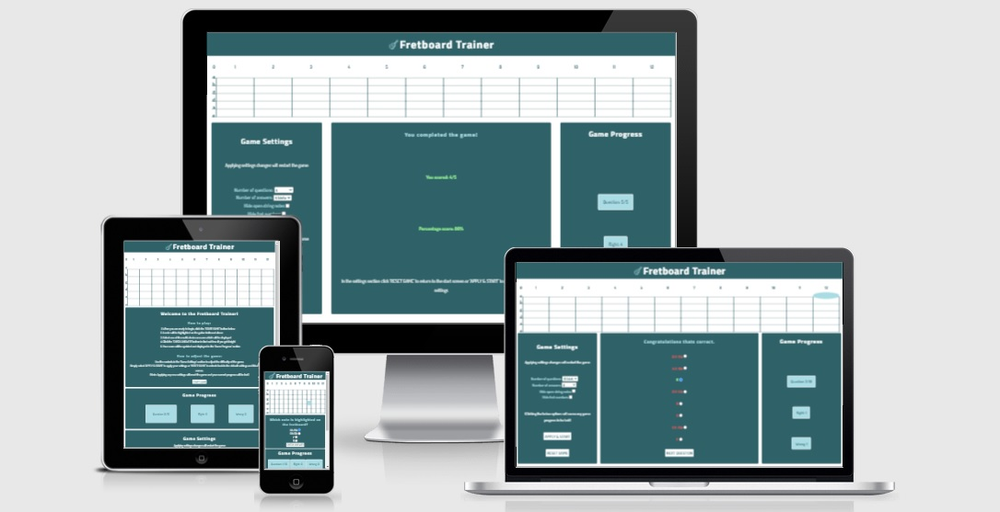

# Fretboard Trainer (finish)

Fretboard Trainer is an interactive website which uses an adjustable multi-choice style quiz, to help those who want to improve their ability to recognise the notes on a 6-stringed guitar in standard tuning. The rules and design are simple and intuative and since the Trainer is based on the layout of a real guitar fretboard, it has a real life application.

This site provides a quick and easy way for guitarists, with different levels of experience, to test and train their knowledge of the guitar fretboard. The Trainer can be used on any platform from a laptop to a phone and for as long or short a time as the user wishes. 

[Image made using <a href = "http://ami.responsivedesign.is/">Am I Responsive Website</a>]

## Contents
---

* [Technologies Used](https://github.com/mountaincharlie/project-two-fretboard-trainer#technologies-used)
* ['section name'](full github url from deployed site)
* 
* 
 
## Technologies Used 
---

* HTML
* CSS
* JavaScript

## Game Instructions  (finished?)
---

* How to play:
    1. The game is started by clicking either the 'START GAME' button or 'APPLY & START' button.
    2. A note will be highlighted on the fretboard diagram and a list of muliple choice answers will be displayed in the Game Play section.
    3. Choose from the list which note you think is highlighted and click the 'CHECK ANSWER' button.
    4. A message will display if the correct note was chosen or not and the Right/Wrong counters in the Game Progress section will be updated.
    5. Once the final question has been answered, click the 'CHECK SCORE' button to find out your final result.
    6. From the Score screen you can replay with the same settings by clicking the 'APPLY & START' button or reset back to default settings and the Instructions screen by clicking the 'RESET GAME' button.

* How to adjust the game:
    * The controls in the Game Settings section can be adjusted to affect the difficult of the game.

## Features (add screenshots)
---

### Header
* [image]
* Heading and guitar icon

### Favicon
* [image]
* same as the guitar icon in the header 

### The fretboard
* [image]
* open string notes
* fret numbers 
* [image shows highlight]
* strings where the random note is highlighted 

### Game Settings section
* [image whole]
* Instructions/warnings [image]
    * None of the settings have to be used as there are set defaults so the user can start playing right away.
* Adjustable settings [image example of what they affect]
    * 'Number of questions' dropdown list
    * 'Number of answers' dropdown list
    * 'Hide open string notes' checkbox
    * 'Hide fret numbers' checkbox
* APPLY & START button [image]
* RESET GAME button [image]

### Game Play section
* Instructions screen [image]
* Questions Screen [image]
* Answer Check Screen [image] 
    * message
    * red/green highlights
* Score Screen [image]
    * fraction and percentage scores
    * highlight red/green for 50% or over
    * instructional message for continuing

### Game Progress section
* [image]
* Question counter 
    * Out of 10 by default
    * Can be adjusted by Game Settings
    * Is used to trigger the score screen
* Right/wrong counters
    * Set to 0 initially 
    * Are updated when the Answer Check Screen is displayed 

## User Experience Design (change colours for contrast??)
---

### Styling 
The styling and layout of the game remains consistent throughout the sections, making it more intuative for the user to interact with and understand the purpose of each section.
* Colour scheme: I chose a dark teal (#2f6168) for the main colour of the game, an orange (#ff8c3f) accent colour throughout the different sections and kept a white background behind the sections and fretboard diagram and white text for the instructional messages, for good contrast.
* Fonts: 
    * Google Font's 'Titillium Web' for all the headings (h1, h2 and h3 elements).
    * Google Font's 'Dosis' for all of the other text on the screen (Instructions, scores, settings, questions and counters).
* Icons:
    * Icon8's 'Guitar icon in Pastel Glyph Style' as an icon with the Fretboard Trainer logo next in the game heading.
    * Favicon made from the same 'Guitar icon in Pastel Glyph Style', for continuity.
* Continuity throughout the game: 
    * The styling and layout of the game remains consistent throughout the sections.
    * Game feedback and instructions are always presented in the central Game Play section making it more intuative for the user.

### Content and Interactivity
* The fretboard diagram:
    * remains at the top of the screen throughout the game so that the user is always aware of where to find it if they are viewing it on a mobile device and have to scroll.
* Layout on smaller screens:
    * when viewed on screen with a width of 830px or less, CSS Media Queries have been used to organise the three game sections ontop of one another. 
    * in order to reduce the user needing to scroll while playing the game, the Game Play section is positioned immediately below the fretboard diagram, with the Game Progress directly below this and the Game Settings at the bottom since they are not required while the game is being played.    
* The central Game Play section:
    * contains clear instructions for the game and the other two sections (Game Settings and Game Progress) to ensure the user understands the purpose of the site and the functions of each section as soon as they land on the page. 
    * this section displays the Instructions screen, Check Answer screen and Score screen each with clear feedback for the user and buttons labelled specific to their function (e.g. the 'CHECK ANSWER' button to check if the right answer was selected or the 'NEXT QUESTION' button to generate and display the next question).
    * default values are applied so that the user doesn't have to adjust any settings and can get started with the game straight away.
* The Game Settings section:
    * remains unchanged during the game, but can be accessed by the user at any point. 
    * dropdown boxes and checkboxes have been used instead of free typing inputs for the user. This is to both make it simpler and quicker for the user to adjust settings and also prevents the user inputting values which would break the game.
* The Game Progress section:
    * the counters are updated as neccessary during the game, as part of the feedback to the user and are reset/adjusted any time the game is refreshed or new settings are applied. 
    * they are also styled to fit with the rest of the site, but differently enough from the buttons so that the user doesn't confuse them as something that can be clicked.

## Accessability (finished?)
---

### Semantic elements
* Header:
    * containing site logo; the guitar icon and site name.
* Headings:
    * applied in the appropriate order (h1, h2 ...).
* Main element:
    * wrapped around the three games sections, which make up the main content of the page. 
* Section elements:
    * for the three game sections, which each have their own h2 headings at the start of their content.
* Button elements:
    * for the buttons used across the sections, which also have descriptive text content.
* Checkbox and Select elements:
    * for the settings instead of creating any custom controls which may have unclear meaning.

### Aria-labels
* To make their purpose clearer and for better accessability, these were addded to:
    * the three game sections
    * the fretboard's div container
    * the settings
    * the settings buttons

### Attributes
* Added the alt attribute to the logo image incase the image failed to loads and to increase screen reader accessability.

## Testing
---

### To do:

### ??? HTML & CSS validator warnings and fixes
* any warnings that come up and how you fixed them

### HTML Validation in Offical W3C Validator
* SHOULD BE: No errors or warnings
* LINK TO THE 'by url'

### CSS Validation in Offical Jigsaw Validator
* SHOULD BE: No errors or warnings
* LINK TO THE 'by url'

### JS Check in JSHint
* SHOULD BE: No errors or warnings
* Metrics avaliable:
    * 
* LINK IF ONE AVALIABLE

### Lighthouse Accessability score

 

### Bugs and Fixes
* I used the 'select' element for the 'Number of questions' and 'Number of Answers' settings to limit the user's options to the most reasonable ones so that the user doesn't have to type in their own value and can't choose a value which would cause an error.
    * its fix ...
* Lighthouse in Google's Dev Tools, highlighted a contrast issue with the orange that was being used as an accent colour
    * its fix ...

### Unfixed bugs
* SHOULD BE: No unfixed bugs

## Deployment
---

### Deployment Process on GitHub
* I selected the Settings tab from within the project-two-fretboard-trainer repository 
* Then selected the Pages tab within Settings
* Then chose Main from the Branch dropdown menu
* Finally, the page then provided the live link to my website and after a few minutes it was ready to be viewed

### Live website link
* <a href = "https://mountaincharlie.github.io/project-two-fretboard-trainer/">Fretboard Trainer</a>

## Credits
---

### Page styling
* To apply Border-box box sizing to the whole document: 
    * <a href="https://css-tricks.com/box-sizing/#universal-box-sizing">'Universal Box Sizing with Inheritance'</a> 
* Google fonts:
    * <a href="https://fonts.google.com/specimen/Titillium+Web?query=Titillium+Web">Titillium Web</a> for all the headings (h1, h2 and h3 elements).
    * <a href="https://fonts.google.com/specimen/Dosis?query=dosis">Dosis</a> for all other text on the site.
    * Pairing reccommended by Lou Levit in <a href="https://www.reliablepsd.com/ultimate-google-font-pairings/">The Ultimate Collection of Google Font Pairings</a> (number 31).
    
### Icons
* <a href="https://icons8.com/icon/110433/guitar">'Guitar icon in Pastel Glyph Style' by Icons8</a> used as an icon in the header and made into a Favicon.
* <a href="https://favicon.io/favicon-converter/">Favicon Converter</a> used to create the favicon from the Icons8 guitar icon.

##  Site Expansion Ideas
---

Features that could be added to expand and improve the website in the future.

### To do:

### Improvement idea
* How it would work/why it would be good